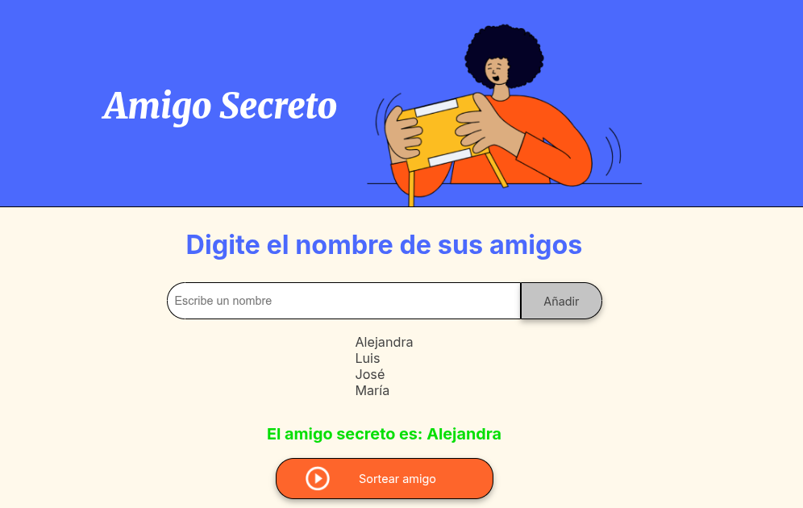

# Challenge Amigo Secreto – Juego interactivo para sortear un amigo secreto en el navegador.

### Este proyecto es parte de un reto del curso de programación, cuyo objetivo es practicar lógica con JavaScript y manipulación del DOM.

**La aplicación permite:**

- Añadir nombres de amigos a una lista.
- Visualizar la lista en tiempo real.
- Sortear un nombre aleatorio.

**Es ideal para aprender conceptos básicos como:**

- Variables y arreglos.
- Funciones y validaciones.
- Eventos y atributos en HTML (```onclick```).
- Uso de métodos como ```createElement```, ```appendChild```, ```innerHTML```, etc.

## Vista Previa



## Cómo usarlo

1. Clona este repositorio:
```git clone``` https://github.com/Alejaxp/challenge-amigo-secreto.git

2. Abre el archivo ```index.html``` en tu navegador.
3. Escribe el nombre de un amigo y presiona "Añadir".
4. Cuando tengas todos los nombres, haz clic en "Sortear amigo secreto" para obtener el ganador.

## Aprendizajes

### Durante el desarrollo aprendí:

- Cómo manejar entradas del usuario (```.value``` y ```.trim()``` para limpiar espacios).
- Validar datos antes de agregarlos.
- Manipular elementos HTML desde JavaScript.
- Generar valores aleatorios con ```Math.random()``` y ```Math.floor()```.

## Mejoras futuras

- Evitar nombres repetidos.
- Permitir borrar amigos de la lista.
- Guardar la lista en el almacenamiento local del navegador (localStorage).
